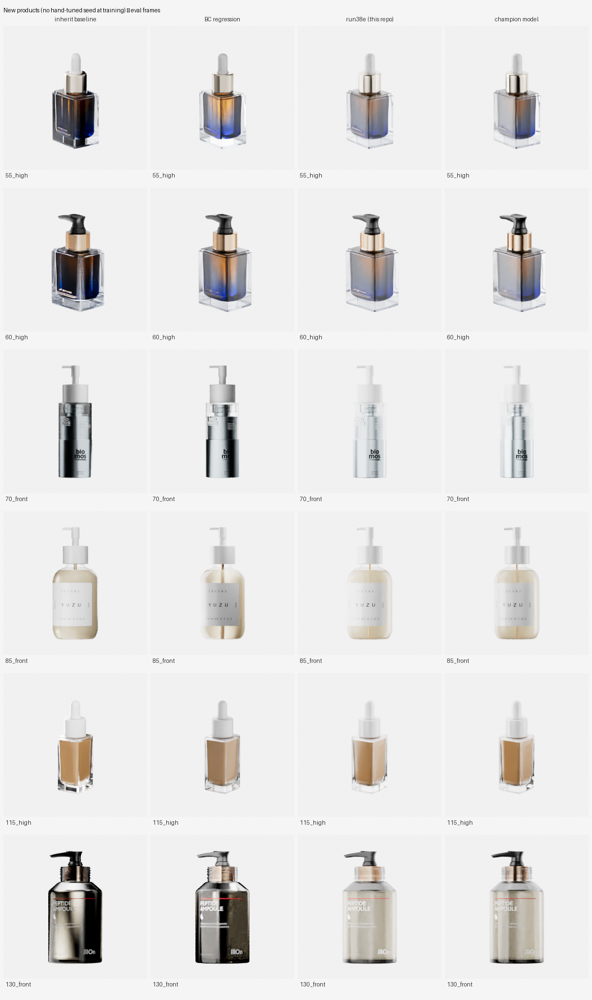
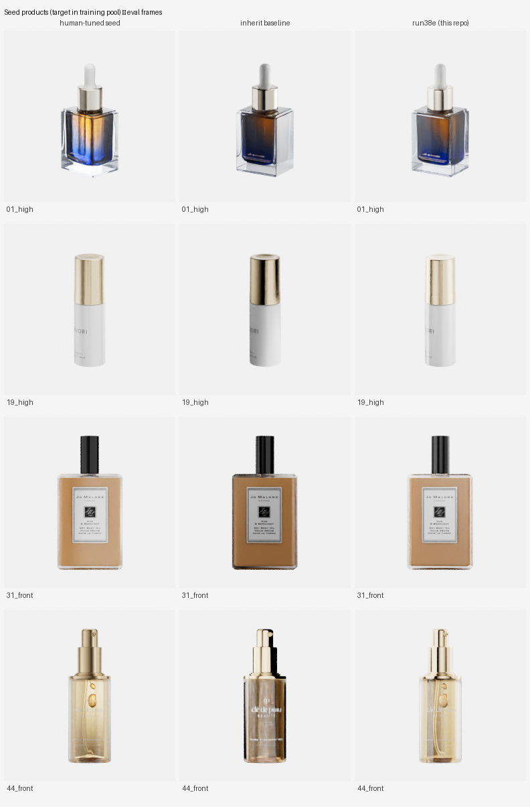

<h1 align="center">blender-rlhf-lighting</h1>

<p align="center"><b>Blender 影棚里的产品自动打光</b><br>
嵌入继承 → 2 步 RLOO 精修 → 人标偏好模型裁决 best-of-16</p>

<p align="center">
  <a href="LICENSE"></a>
  <a href="pyproject.toml"></a>
  <a href="https://www.blender.org/"></a>
</p>

<p align="center">English: <a href="README.md">README.md</a> · 文档：<a href="docs/method.md">method</a> · <a href="docs/evaluation.md">evaluation</a> · <a href="docs/reproduction.md">reproduction</a></p>

---

## 效果

RM z 分，确定性策略评估，DINOv2-L 偏好模型（同一行内同尺）：

| 池 | Δ vs 基线 | 胜格 | Δ vs 监督回归 |
|---|---|---|---|
| 种子产品（32） | **+1.674** | 31/32 | +0.446 |
| 留出产品（12） | **+0.793** | 12/12 | +0.379 |
| 新品（85） | **+1.200** | 79/85 | +0.780 |

- **基线** = 噪继承原样交付 · **监督回归** = 在种子上拟合的回归件
- **人眼盲评**（新品池 85 对，双盲）：对历代最强模型 **0.472 vs 0.528**——统计平局（p≈0.90），
  且 **58% 的对子标注者判定两边不可区分**

<table>
<tr>
<td></td>
<td></td>
</tr>
<tr>
<td align="center"><sub><b>新品池</b> — 噪继承基线 · 监督回归 · <b>本仓库终版</b> · 历代最强基线</sub></td>
<td align="center"><sub><b>种子产品</b> — 人工种子 · 噪继承基线 · <b>本仓库终版</b></sub></td>
</tr>
</table>

---

## 方法一览

```
新品 ─▶ 嵌入最近邻继承（起点）
     ─▶ 策略 2 步精修（step1 渲预览图 → obs2；step2 渲终值图）
     ─▶ RM 裁决 best-of-16（部署） / RM z 分（训练奖励）
```

**策略训练器 = RLOO**（`scripts/train/rloo_continuous_action.py`）：

| 方面 | 设计 |
|---|---|
| 成组采样 | `reset()` 抽一个起点（产品 / 机位 / 抖动 / 继承配置+噪声），`reset_replay()` 把它逐字重放 K=10 次；组内唯一差异来自策略自身的 σ 采样 |
| 优势估计 | 精确 leave-one-out：`A_i = R_i − mean(R_{j≠i})`。**无 critic、无 GAE、无自举**——2 步定长 episode + 终端 RM 奖励（r1 ≡ 0）下，价值函数只会带来一个可被钻的错误面 |
| 为什么不用 off-policy | SAC 前任经五连修复才把奖励从 −0.93 抬到 −0.49，且始终渐近于"什么都不做"的基线：replay 旧数据 + 自举 Q + actor 最大化 Q，会让 actor 专挑 critic 的外推误差（实测 Q 估值 9~19 而真实回报 ≈ −2） |
| 稳定性 | 只要刹车不要奖金：clip 0.2 · target-KL 0.2 早停 · 梯度裁剪 0.5 · 塌缩预警链 · 每 5 轮存 ckpt；σ 自学自退火（无熵奖励） |
| 吞吐 | 两个常驻 Blender 渲染 worker；46 起点 × K10 × 2 步 = 每轮 920 环境步（300k 步 ≈ 326 轮） |

完整配方、观测布局与阈值见 [docs/method.md](docs/method.md)

---

## 10 分钟验证

1. 从 [Releases](https://github.com/JQINF/blender-rlhf-lighting/releases) 下载四个资产

   | 资产 | 放到 |
   |---|---|
   | `run38e_final.pt`（策略）、`rm_v19c.pt`（RM） | `logs/ckpt/` |
   | `stage_pack.zip`（影棚场景） | 解压到 `scene/` |
   | `samples.zip`（示例产品 + 嵌入 + 种子） | 解压到 `model/`、`data/embeddings/`、`seeds/` |

2. 装依赖：`uv sync`（细节见 [docs/reproduction.md](docs/reproduction.md)）
3. 跑一次：

```bash
HF_HUB_OFFLINE=1 .venv/bin/python scripts/deploy_light.py --sku 52 --view front \
  --actor logs/ckpt/run38e_final.pt --rm-ckpt logs/ckpt/rm_v19c.pt \
  --out logs/rollout/result.json
```

或在 Blender 里：装 `addons/lighting_deploy`，打开 `scene/stage.blend`，点 **自动打光**
（NN 继承 → 策略精修 → best-of-16 → winner 上场景）。插件若定位不到项目根，设
`LRL_PROJECT_ROOT=<仓库路径>`。

---

## 仓库结构

```
scripts/    env/（渲染档位、常驻 worker、机位、产品接入）· train/（rloo 训练器、RM 训练、
            评估、盲标工具）· debug/（日志速读、部署冒烟）
addons/     lighting_rl（交互调光记录）+ lighting_deploy（一键部署）
seeds/      46 个手调种子（72 维，front/high）+ 通用模板
docs/       method · evaluation · reproduction（中英各一份）
images/     上面两张对比网格
```

---

## 关键结论

1. **覆盖即泛化**——种子灯光的方差 **94.8% 是产品特异的**，且该残差无法从任何产品观测预测
   （嵌入 / 逐灯贡献图、线性或非线性：R² ≤ 0，46 个产品 0 个为正）。因此新品要打好光，
   靠的是**每个产品存一颗人工调好的种子**。
2. **裁决力 ≠ 奖励力**——偏好模型当裁判更好，不等于当 RL 奖励能训出更好的策略
   （实测：裁决一致率 +6.3pt 的同时，策略新品人尺 0.373 → 0.156）。
3. **离策略结构在此任务上不可救**——见上表 SAC 一栏；去掉 critic（RLOO）即根治。

---

## 资产与许可

- 代码 MIT（[LICENSE](LICENSE)）；权重与种子随 MIT，无担保
- 示例产品（`samples.zip`）仅限演示用途
- **训练数据不随仓库分发**：不含对子标注与渲染图集。仓库提供标注与训练工具——用
  `label_server` 标自己的对子，即可训练属于你自己口味的 RM
- **自带模型验证**：按接入契约（`product` 集合 + 最长边 1.0m + bbox 居中 + 旋转已 apply）
  放入你自己的 `.blend`，用随仓库发布的权重跑通「继承 → 精修 → 裁决」全链路

## 引用

```bibtex
@misc{blender-rlhf-lighting,
  title  = {blender-rlhf-lighting: RL-refined product lighting for Blender studios},
  year   = {2026},
  note   = {https://github.com/JQINF/blender-rlhf-lighting}
}
```
